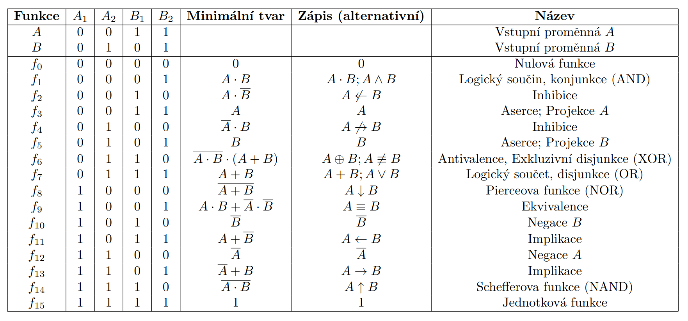

# Logické funkce a jejich vlastnosti

Činnost logických obvodů lze popsat pomocí symbolického jazyka, který vychází z výrokové logiky.

**Výrokem** rozumíme tvrzení o kterém má smysl říci, že je pravdivé nebo nepravdivé.

- Pravdivému výroku přiřazujeme hodnotu *logické jedničky*.
- Nepravdivému výroku přiřazujeme hodnotu *logické nuly*.
- Jednotlivé výroky jsou reprezentovány *logickými proměnnými*.

**Logickou funkcí** nazveme funkční přiřazení mezi nezávislými logickými proměnnými.

Logickou funkci lze vyjádřit:

- algebraickým výrazem
- pravdivostní tabulkou
- mapou logické funkce
- logickým schématem

Každou funkci lze vyjádřit prostřednictvím nějakého omezeného počtu vhodně vybraných funkcí, tzv. *úplného souboru funkcí*. V praxi se nejčastěji používá soubor tvořený funkcemi: *negace-konjunkce-disjunkce* a tvoří základ tzv. dvouhodnotové Booleovy algebry. Tento soubor není sice minimální, ale je jednoduchý a názorný. Zároveň fyzikální realizace booleovských funckí je snadná.

**Minimální soubor funkcí** je takový úplný soubor funkcí, v němž již nelze jednu funkci ze souboru nahradit kominací ostatních funcí souboru. Minimální soubory jsou například: *negace-konjunkce*, *negace-disjunkce*.

**Logické funkce dvou proměnných**

## Booleova algebra
Booleova algebra je odvětví matematické logiky, které se zabývá operacemi s logickými hodnotami a funkcemi. Základy této algebry položil George Boole v polovině 19. století. 

Booleova algebra je algebra s obrem hodnot { $0, 1$ } a třídou operací { $+, \cdot, \overline{ }$ }.

Logický součit, součet a negace jsou definovány takto:

- $0+0 = 0$
- $0+1 = 1+0 = 1+1 = 1$
- $1 \cdot 1 = 1$
- $1 \cdot 0 = 0 \cdot 1 = 0 \cdot 0 = 0$
- $\overline{0} = 1$
- $\overline{1} = 0$

**Základní pravidla Booleovy algebry:**

## Karnaughova mapa (K-map) 
je grafická metoda používaná k minimalizaci logických výrazů v Booleově algebře. Pomáhá jednoduchým a přehledným způsobem redukovat složité logické funkce na jejich nejjednodušší podobu. Tato metoda je zvláště užitečná při návrhu logických obvodů.

### Struktura Karnaughovy mapy
Karnaughova mapa je tabulka, kde každé pole odpovídá určité kombinaci hodnot vstupních proměnných. Pole jsou uspořádána tak, aby se sousední pole lišila vždy pouze v jedné proměnné (Grayův kód). Pro $n$ proměnných má mapa $2^n$ polí.

### Postup minimalizace pomocí Karnaughovy mapy

- Nakreslení Karnaughovy mapy odpovídající počtu proměnných.
- Zapsání hodnot logické funkce (0 nebo 1) do příslušných polí mapy podle hodnot vstupních proměnných.
- Seskupení jedniček (1) do co největších obdélníkových nebo čtvercových bloků.
  - Bloky musí mít velikost mocniny čísla 2 (1, 2, 4, 8 atd.).
  - Bloky mohou být vodorovné nebo svislé (nikoliv diagonální).
  - Karnaughova mapa je nekonečná, což znamená, že levý a pravý okraj, stejně jako horní a dolní okraj, jsou spojeny.
  - Bloky se mohou (částčně) překrývat. 
  - Každá jednička (1) musí být v nějakém bloku
  - Počet bloků musí být co nejmenší. (Bloky musí být co největší)
- Zapsání minimalizovaného výrazu na základě seskupených bloků.

> Poznámka:
> pokud seskupujem do bloků jedničky (1), vzniká zápisem disjuktní normální forma (součet součinů). Můžeme rovněž seskupovat nuly (0), pak vzniká konjuktní normální forma (součin součtů).

### Příklad:

