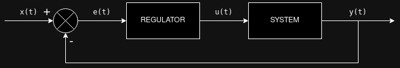

# Princip řízení pomocí zpětné vazby

schema systému zapojeného ve zpětné vazbě s regulátorem, kde:

- $x(t)$ je požadovaná hodnota výstupu.
- $e(t)$ je chyba (rozdíl) výstupu a vstupu ($e(t) = y(t) - x(t)$
- $u(t)$ je řídící veličina. Hodnota generovaná regulátorem, která je přivedená na vstup systému.
- $y(t)$ je výstup systému.

### P-Regulátor (Proporcionální regulátor):

#### 1. **Diferenciální rovnice (Proporcionální regulátor)**:
Proporcionální regulátor se řídí jednoduchým vztahem mezi vstupní chybou a regulačním signálem. Regulátor generuje regulační akci, která je úměrná okamžité hodnotě chyby.

$u(t) = K_P \cdot e(t)$
Kde:
- $u(t)$ je výstup regulátoru (regulační akce),
- $K_P$ je proporcionální zisk (zesílení) - nastavuje sílu reakce regulátoru,
- $e(t)$ je chyba systému ($e(t) = \text{žádaná hodnota} - \text{skutečná hodnota}$).

#### 2. **Přenosová funkce (Proporcionální regulátor)**:
Přenosová funkce popisuje vztah mezi vstupem a výstupem systému v Laplaceově doméně:

$G(s) = K_P$

#### 3. **Vysvětlení**:
Proporcionální regulátor reaguje na chybu v systému tím, že aplikuje sílu, která je úměrná velikosti chyby. Čím větší je chyba, tím větší je regulační akce. Proporcionální regulátor může způsobit zbytkovou chybu v ustáleném stavu, protože nikdy úplně neeliminuje chybu.

---

### I-Regulátor (Integrační regulátor):

#### 1. **Diferenciální rovnice (Integrační regulátor)**:
Integrační regulátor vytváří výstup, který závisí na integrálu chyby. Výstup se neustále zvyšuje nebo snižuje v závislosti na tom, zda je chyba kladná nebo záporná. Integrační složka pomáhá eliminovat zbytkovou chybu v ustáleném stavu.

$u(t) = K_I \int\limits_{0}^{t} e(\tau) \, d\tau$

Kde:
- $K_I$ je integrační zisk (zesílení),
- $\int\limits_{0}^{t} e(\tau) \, d\tau$ je integrál chyby v čase.

#### 2. **Přenosová funkce (Integrační regulátor)**:
Přenosová funkce pro integrační regulátor:

$G(s) = \frac{K_I}{s}$

#### 3. **Vysvětlení**:
Integrační regulátor se zaměřuje na akumulaci chyby v průběhu času. Jeho hlavní funkcí je eliminace zbytkové chyby, která by mohla zůstat po použití pouze proporcionálního regulátoru. Pokud je chyba kladná, integrační akce zvyšuje výstup, dokud není chyba nulová. Při špatném nastavení může I-regulátor způsobit „nabalování“ (wind-up), což vede k pomalé reakci nebo přestřelení.

---

### D-Regulátor (Derivační regulátor):

#### 1. **Diferenciální rovnice (Derivační regulátor)**:
Derivační regulátor vytváří výstup, který závisí na rychlosti změny chyby. Čím rychleji se chyba mění, tím silnější je regulační akce.

$u(t) = K_D \cdot \frac{de(t)}{dt}$

Kde:
- $K_D$ je derivační zisk (zesílení),
- $\frac{de(t)}{dt}$ je časová derivace chyby.

#### 2. **Přenosová funkce (Derivační regulátor)**:
Přenosová funkce pro derivační regulátor:

$G(s) = K_D \cdot s$

#### 3. **Vysvětlení**:
Derivační regulátor reaguje na rychlost změny chyby. Pokud se chyba rychle zvyšuje nebo snižuje, derivační regulátor poskytne silnou regulační akci k vyrovnání změny. Jeho hlavní funkcí je tlumení oscilací a zlepšení stability systému. Derivační regulátor je velmi citlivý na šum, protože jakékoli malé změny v chybě mohou způsobit velké výstupní akce.

## PID regulátor:

PID je navržen pro regulaci hodnot procesů, například teploty, rychlosti, tlaku nebo polohy. PID je zkratka pro Proporcionální (P), Integrální (I) a Derivační (D) složky regulátoru. Každá z těchto složek přináší určité vlastnosti do regulace a společně tvoří efektivní nástroj pro udržení regulovaného procesu na požadované hodnotě.

výstup PID regulátoru lze vypočítat:

$u(t) = K_p \cdot e(t) + K_i \int e(t) \,dt + K_d \frac{de(t)}{dt}$,

kde:

- $e(t)$ je chyba ($e(t) = y(t) - x(t) $výstup systému - požadovaný vstup)

- $K_p$, $K_i$, $K_d$, jsou konstanty složek (proporcionální, integrační, derivační)

V Lapalaceově přenosu:

$G(s) = K_p + \frac{K_i}{s} + K_d \cdot s$

### Nastavování PID regulátoru:

- Manuální ladění: Nastavení PID parametrů lze provádět experimentálně, kdy se postupně zvyšuje $Kp$​, dokud nedosáhneme dobré odezvy, pak se přidá $Ki$​, a nakonec $Kd​$.

- Ziegler-Nichols metoda: Jedna z nejčastějších metod pro ladění PID parametrů, která využívá oscilace systému při daných hodnotách PID parametrů.

- Automatické ladění: Některé systémy mají automatické algoritmy pro nastavení PID parametrů, které sledují chování systému a přizpůsobují parametry v reálném čase.

a další

### Ziegler-Nichols metoda

je klasická a široce používaná metoda pro ladění parametrů PID regulátorů. Tato metoda byla vyvinuta Zieglerem a Nicholsem ve 40. letech 20. století a je založena na experimentálním přístupu, kdy se regulátor nastavuje přímo na systému, aby se dosáhlo požadovaných parametrů pro stabilní a dynamickou odezvu.

Ziegler-Nicholsova metoda existuje ve dvou variantách:

- Metoda reakční křivky (také známá jako "open-loop" metoda),
- Metoda periodických oscilací (také známá jako "closed-loop" metoda).

Jako příklad si uvedeme metodu **periodických oscilací**:

Tato metoda se používá v uzavřené smyčce a je založena na nastavení regulátoru pouze s proporcionální složkou (P regulátor). Postup je následující:

1. Nastavte regulátor tak, že vypnete integrální a derivační složky (tj. $K_i=0$ a $K_d=0$) a postupně zvyšujte proporcionální zesílení $K_p$​, dokud systém nezačne kmitat s konstantní amplitudou. Tento bod je známý jako kritické zesílení $K_u$ (ultimate gain).
2. Změřte periodu oscilací $Tu$​ (ultimate period), což je doba jednoho cyklu oscilace.
3. Nastavní parametrů $K_p$, $K_i$, $K_d$ podle tabulky:

| Control Type            | $K_p$              | $T_i$                  | $T_d$                 | $K_i$                        | $K_d$                     |
|-------------------------|--------------------|------------------------|-----------------------|------------------------------|---------------------------|
| P                       | $0.5 K_u$          | –                      | –                     | –                            | –                         |
| PI                      | $0.45 K_u$         | $0.83 T_u$             | –                     | $0.54 K_u / T_u$             | –                         |
| PD                      | $0.8 K_u$          | –                      | $0.125 T_u$           | –                            | $0.10 K_u T_u$            |
| Classic PID             | $0.6 K_u$          | $0.5 T_u$              | $0.125 T_u$           | $1.2 K_u / T_u$              | $0.075 K_u T_u$           |
<!--| Pessen Integral Rule    | $0.7 K_u$          | $0.4 T_u$              | $0.15 T_u$            | $1.75 K_u / T_u$             | $0.105 K_u T_u$           |
| Some Overshoot          | $0.33 K_u$         | $0.50 T_u$             | $0.33 T_u$            | $0.67 K_u / T_u$             | $0.11 K_u T_u$            |
| No Overshoot            | $0.20 K_u$         | $0.50 T_u$             | $0.33 T_u$            | $0.40 K_u / T_u$             | $0.067 K_u T_u$           |
-->

Metoda Zieglera-Nicholse je heuristická metoda ladění PID regulátorů, která má za cíl především:

1. **Agresivní reakci a oscilace**: Tato metoda nastavuje parametry regulátoru tak, aby zajistila rychlou a oscilující odezvu, což vede k **vysoké citlivosti** systému, ale často také k **překmitům** a **oscilacím**. Tento přístup je vhodný pro systémy, kde je prioritou rychlá odezva nad minimalizací překmitů.

2. **Blízkost ke stabilitě**: Metoda se snaží o nastavení parametrů, které přiblíží systém k hranici stability, ale **nezaručuje plnou stabilitu** ve všech případech. Klasické ladění podle Zieglera-Nicholse vede k **marginalně stabilnímu** nebo lehce oscilujícímu systému, což znamená, že pokud se změní podmínky systému, může se stát nestabilním. V případech, kdy je stabilita zásadní, je obvykle nutné provést další úpravy parametrů.

3. **Kompromis v kvalitě překmitu**: Ačkoliv metoda Zieglera-Nicholse často vytváří systém s rychlou odezvou, dochází k tomu za cenu **vyšších překmitů** a **delší doby ustálení**. Metoda se nesnaží přímo optimalizovat překmit nebo dosáhnout kritického tlumení.

V praxi se často po prvotním ladění podle Zieglera-Nicholse provádí další dolaďování parametrů, zejména v systémech, kde jsou klíčovými výkonnostními metrikami překmit a stabilita.

