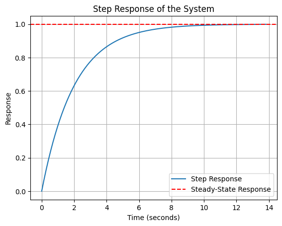
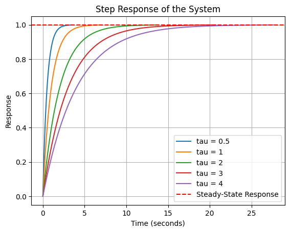
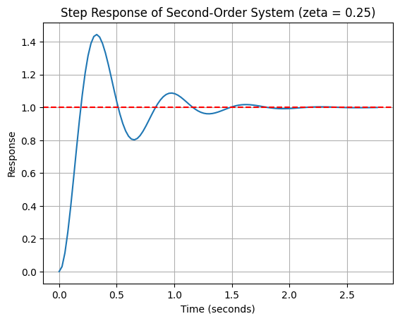
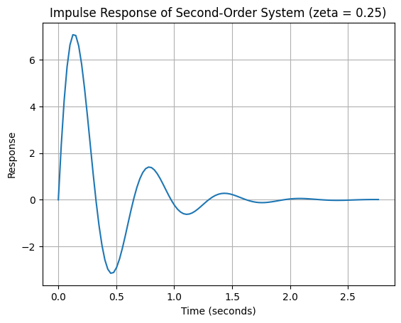
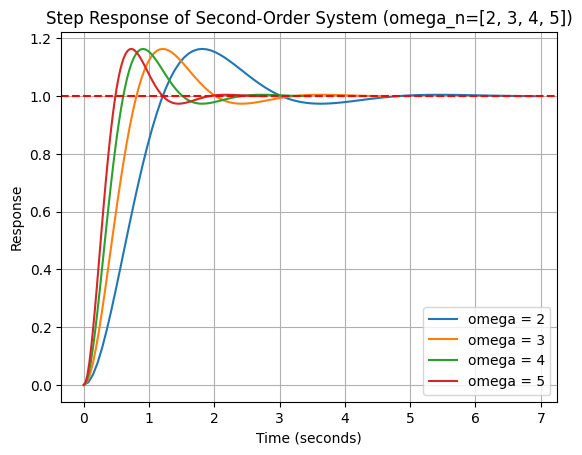
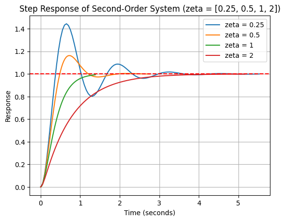

# System:

A system is any process, object, or arrangement of components that takes an input and transforms it into an output through some form of internal dynamics or operation. Systems can be found in various fields, including engineering, biology, economics, and social sciences. They can be natural (such as ecosystems) or man-made (such as mechanical, electrical, or control systems).

In the context of control theory and engineering, a system is typically defined as:

- A set of components or elements that interact with each other according to certain rules or laws.
- The system takes one or more inputs and produces one or more outputs.
- Internal dynamics govern how the input is processed or transformed to produce the output.

## Classification of Systems:

1. **Oriented vs. Non-Oriented Systems**:
   - **Oriented Systems**: These systems have a clear direction of interaction, often involving inputs and outputs with specific roles. For example, in a control system, the flow is directed from input to output (causal).
   - **Non-Oriented Systems**: These systems lack a clear direction of interaction. Components influence each other without a specific input-output relationship. An example would be a network of interconnected components, such as an electrical grid.

2. **Causal vs. Non-Causal Systems**:
   - **Causal Systems**: The output of the system at any time depends only on past and present inputs. The future inputs do not affect the current output. Most physical systems are causal.
     - Example: In a typical electrical circuit, the output voltage at a specific time depends only on current or past inputs.
   - **Non-Causal Systems**: These systems have outputs that depend on future inputs. Non-causal systems are typically theoretical or mathematical and cannot exist in real-time systems since they require knowledge of future inputs.
     - Example: Telling the future.

3. **Deterministic vs. Stochastic Systems**:
   - **Deterministic Systems**: The behavior of the system is completely predictable and determined by the system's initial conditions and inputs. There is no randomness involved.
     - Example: The motion of a pendulum in a vacuum, where its future position is completely determined by its initial position and velocity.
   - **Stochastic Systems**: The system's behavior includes some level of randomness or uncertainty. Even if the initial conditions and inputs are known, the exact output cannot be predicted with certainty.
     - Example: Stock market prices or weather patterns, which are influenced by random or probabilistic events.

4. **Dynamic vs. Static Systems**:
   - **Dynamic Systems**: The system’s output depends on time and its past behavior (memory). Dynamic systems are described by differential or difference equations, and their output evolves over time.
     - Example: A car's suspension system, which reacts to bumps over time.
   - **Static Systems**: The output of the system depends only on the current input and not on past inputs or states (no memory). These systems have no internal dynamics and are often modeled by algebraic equations.
     - Example: A simple resistor, where the voltage across it is proportional to the current at any instant, without regard to past currents.

## External Description of a System

In control theory and systems engineering, a system can be described externally in various ways. These descriptions capture how the system responds to external inputs, and they are used to model and analyze the system’s behavior. Common external descriptions include:

1. **Differential Equation**:
   - A **differential equation** describes the relationship between the input and output of a system in the time domain, as well as how the output evolves over time. For **dynamic systems**, the output is expressed as a function of the system's input and its derivatives.
   
   **Example**:
   For a first-order system, the differential equation is:
   
   $\tau \frac{dy(t)}{dt} + y(t) = K u(t)$
   
   Where:
   - $y(t)$ is the output.
   - $u(t)$ is the input.
   - $\tau$ is the time constant.
   - $K$ is the system gain.

   This is commonly used for modeling mechanical, electrical, and thermal systems in the time domain.

2. **Transfer Function (in Laplace Transform)**:
   - The **transfer function** is the ratio of the output to the input of a system, expressed in the **Laplace domain**. The transfer function gives a compact way to represent a system’s behavior by converting differential equations into algebraic equations using the Laplace transform.
   
   **Example**:
   The transfer function for a first-order system is:
   
   $G(s) = \frac{Y(s)}{U(s)} = \frac{K}{\tau s + 1}$
   
   Where:
   - $G(s)$ is the transfer function.
   - $Y(s)$ is the Laplace transform of the output $y(t)$.
   - $U(s)$ is the Laplace transform of the input $u(t)$.
   - $s$ is the complex frequency variable in the Laplace domain.
   
   The transfer function is particularly useful for analyzing the system’s frequency response and stability.

3. **Step Response (Transition Function)**:
   - The **step response** describes the time-domain behavior of a system when subjected to a step input (i.e., an input that changes abruptly from zero to a fixed value). The **step response** shows how the system output evolves from an initial state to its steady-state value after a sudden change in input.
   
   **Example**:
   For a first-order system with transfer function $G(s) = \frac{K}{\tau s + 1}$, the step response in the time domain is:
   
   $y(t) = K \left( 1 - e^{-t/\tau} \right)$
   
   The step response gives insight into the system’s rise time, settling time, and steady-state value.

4. **Step Response Characteristic**:
   - The **step response characteristic** refers to specific metrics derived from the step response, such as:
     - **Rise Time**: Time taken to rise from 10% to 90% of the final value.
     - **Settling Time**: Time taken for the output to remain within a certain percentage (e.g., 2%) of its final value.
     - **Overshoot**: The extent to which the output exceeds the desired final value.
     - **Steady-State Error**: The difference between the final output and the desired steady-state output.

5. **Impulse Response**:
   - The **impulse response** is the output of the system when subjected to a Dirac delta function (impulse input) at time $t = 0 $. It provides insight into how the system reacts to a very short, sharp input.
   
   **Example**:
   For a first-order system, the impulse response is the derivative of the step response:
   
   $h(t) = \frac{K}{\tau} e^{-t/\tau}, \quad t \geq 0$
   
   The impulse response is particularly useful for analyzing a system’s transient behavior and serves as the building block for more complex inputs via convolution.

6. **Impulse Response Characteristic**:
   - The **impulse response characteristic** provides a complete description of the system’s dynamics. Since the impulse response represents the system’s reaction to a very short input, it can be used to determine how the system responds to any arbitrary input through **convolution**.

## A first-order control system 
typically refers to a system that has a transfer function in the form:

$G(s) = \frac{K}{\tau s + 1}$

Where:
- $G(s)$: is the transfer function of the system.
- $K$: is the system gain. It represents the ratio of the output magnitude to the input magnitude at steady-state.
- $\tau$ (tau): is the time constant of the system. It indicates how quickly the system responds to changes. A smaller time constant results in a faster system response.
- $s$: is the Laplace variable (complex frequency), which is a standard part of transfer functions in the Laplace domain.

The first-order system described by this transfer function is often used to model simple dynamic systems, such as thermal processes, fluid systems, or electrical circuits with resistance and capacitance.

| Step response | Impulse response |
| ---- | ---- |
| $y(t)=K\left(1−e^{\frac{−t}{τ}}\right)$ | $y(t) = \frac{K}{\tau} e^\frac{-t}{\tau}$ |
|  |  |

### Key Concepts in First-Order Systems:
1. **Step Response**: 
   - The response of the system to a step input is an exponential curve. The system starts at 0 and asymptotically approaches $K$, which is the steady-state output.
   - The time constant $\tau$ defines how fast the response approaches the steady state. After a time of approximately $4-5\tau$, the system is considered to have reached its steady state.
   
2. **Rise Time**: 
   - The rise time is the time it takes for the system to go from 0% to 63% of its final value. This time is typically around 1 time constant $\tau$.
   
3. **Settling Time**: 
   - The settling time is the time it takes for the system output to settle within a certain percentage of the final value, typically within 2% or 5%. For a first-order system, the settling time is approximately $4\tau$.

## Examples of **first-order systems**:

### 1. **Electrical System: RC Circuit**
- **System Description**: A resistor-capacitor (RC) circuit, where the voltage across the capacitor is the system output and the input is a voltage source.
- **Transfer Function**:
    
    $G(s) = \frac{1}{RCs + 1}$
    
- **Differential Equation**:
    
    $RC \frac{dV_{out}}{dt} + V_{out}(t) = V_{in}(t)$
    
- **Explanation**: The RC circuit stores energy in the capacitor, and the resistor dissipates energy. The output voltage across the capacitor depends on the time constant $RC$, which governs how fast the capacitor charges or discharges.

### 2. **Mechanical System: Mass-Damper System**
- **System Description**: A mechanical system consisting of a mass connected to a damper. The input is a force applied to the mass, and the output is the velocity of the mass.
- **Transfer Function**:
    
    $G(s) = \frac{1}{ms + b}$
    
- **Differential Equation**:
    
    $m\frac{dv(t)}{dt} + bv(t) = F(t)$
    
- **Explanation**: In this system, the damper provides resistance to motion proportional to velocity. The mass' velocity changes in response to applied forces, and the system is first-order because it only involves velocity (no acceleration term).

### 3. **Thermal System: Heat Exchanger**
- **System Description**: A simple thermal system where heat is applied to a material, and the output is the temperature of the material.
- **Transfer Function**:
    
    $G(s) = \frac{1}{\tau s + 1}$
    
- **Differential Equation**:
    
    $\tau \frac{dT(t)}{dt} + T(t) = T_{in}(t)$
    
- **Explanation**: The time constant $\tau$ represents the thermal capacity of the material and how fast it can reach the input temperature. The system is first-order because it relates temperature to heat transfer.

### 4. **Hydraulic System: Fluid Tank**
- **System Description**: A tank with fluid input and a drainage mechanism. The input is the flow rate into the tank, and the output is the fluid height.
- **Transfer Function**:
    
    $G(s) = \frac{1}{\tau s + 1}$
    
- **Differential Equation**:
    
    $\tau \frac{dh(t)}{dt} + h(t) = Q_{in}(t)$
    
- **Explanation**: The time constant $\tau$ represents the system's capacity to store fluid and how fast it reacts to changes in input flow rate. The output is the height of the fluid in the tank.

### 5. **Chemical System: CSTR (Continuous Stirred-Tank Reactor)**
- **System Description**: A chemical reactor where reactants are continuously fed, and products are continuously removed. The input is the concentration of reactants entering the system, and the output is the concentration of products.
- **Transfer Function**:
    
    $G(s) = \frac{1}{\tau s + 1}$
    
- **Differential Equation**:
    
    $\tau \frac{dc(t)}{dt} + c(t) = c_{in}(t)$
    
- **Explanation**: In this chemical system, the concentration of reactants in the reactor changes over time, and the time constant $\tau$ determines how quickly the reactor reaches equilibrium.

### Overview 

| **System**                 | **Transfer Function**                      | **Differential Equation**                                     |
|----------------------------|--------------------------------------------|---------------------------------------------------------------|
| **RC Circuit**              | $\frac{1}{RCs + 1}$                      | $RC \frac{dV_{out}}{dt} + V_{out}(t) = V_{in}(t)$            |
| **Mass-Damper System**      | $\frac{1}{ms + b}$                       | $m\frac{dv(t)}{dt} + bv(t) = F(t)$                           |
| **Heat Exchanger**          | $\frac{1}{\tau s + 1}$                   | $\tau \frac{dT(t)}{dt} + T(t) = T_{in}(t)$                   |
| **Fluid Tank**              | $\frac{1}{\tau s + 1}$                   | $\tau \frac{dh(t)}{dt} + h(t) = Q_{in}(t)$                   |
| **CSTR**                    | $\frac{1}{\tau s + 1}$                   | $\tau \frac{dc(t)}{dt} + c(t) = c_{in}(t)$                   |

See similarities in transfer functions.

## A second-order control system
is more complex than a first-order system and can describe a wider range of dynamic behaviors. The general transfer function of a second-order system is:

$G(s) = \frac{\omega_n^2}{s^2 + 2 \zeta \omega_n s + \omega_n^2}$ 

Where:
- $G(s)$: Transfer function of the system.
- $\omega_n$ (natural frequency): This determines the speed of the system’s oscillations in the absence of damping. It characterizes the inherent frequency of oscillation of the system.
- $\zeta$ (damping ratio): This controls how oscillations decay over time. It determines the system's response type:
  - $\zeta = 0$: Undamped system (purely oscillatory).
  - $0 < \zeta < 1 $: Underdamped system (oscillatory but eventually settles).
  - $\zeta = 1$: Critically damped system (fastest settling without oscillation).
  - $\zeta > 1$: Overdamped system (slow response without oscillation).

The **second-order system** is useful for modeling physical systems that exhibit oscillations, such as mechanical systems (mass-spring-damper) or electrical circuits (LC or RLC circuits).

| Step response | Impulse response |
| ---- | ---- |
| $y(t) = 1 - \frac{1}{\sqrt{1-\zeta^2}} e^{-\zeta \omega_n t} \sin\left(\omega_n \sqrt{1-\zeta^2} t + \phi\right) \textnormal{, for } \zeta < 1$  | $y(t) = \frac{\omega_n}{\sqrt{1-\zeta^2}} e^{-\zeta \omega_n t} \sin\left(\omega_n \sqrt{1-\zeta^2} t\right) \textnormal{, for } \zeta <1$ |
|  |  |

### Key Performance Metrics

Several key metrics are used to evaluate the performance of a second-order system:

- Peak Time (tp):
        The time at which the system first reaches its maximum value during an oscillation. This is typically applicable for underdamped systems.
- Maximum Overshoot:
        The amount by which the system's output exceeds the final steady-state value, expressed as a percentage.
- Settling Time (ts​):
        The time it takes for the system to settle within a specified range of the final value (typically within 2% or 5%). For underdamped systems, the settling time is related to the damping ratio ζζ and the natural frequency ωnωn​.
- Rise Time (tr​):
        The time taken for the system’s response to rise from 10% to 90% of its final value.

| effect of omega | effect of zeta |
| ---- | ---- |
|  |  |

## Examples of **second-order systems**:

### 1. **Mechanical System: Mass-Spring-Damper**
- **System Description**: A mass attached to a spring and damper. The input is the applied force, and the output is the displacement of the mass.
- **Transfer Function**:
    
    $G(s) = \frac{1}{ms^2 + bs + k}$
    
- **Differential Equation**:
    
    $m\frac{d^2x(t)}{dt^2} + b\frac{dx(t)}{dt} + kx(t) = F(t)$
    
- **Explanation**: The mass-spring-damper system involves second-order dynamics due to both the mass's inertia (second derivative) and the damping and stiffness forces (first derivative and displacement).

### 2. **Electrical System: RLC Circuit**
- **System Description**: A series **RLC** circuit with a resistor (R), inductor (L), and capacitor (C) connected in series. The input is the voltage applied, and the output is the voltage across the capacitor.
- **Transfer Function**:
    
    $G(s) = \frac{1}{LCs^2 + RCs + 1}$
    
- **Differential Equation**:
    
    $L\frac{d^2q(t)}{dt^2} + R\frac{dq(t)}{dt} + \frac{q(t)}{C} = V_{in}(t)$
    
- **Explanation**: The system is second-order because of the energy storage elements (inductor and capacitor) that involve both current and voltage derivatives.

### 3. **Mechanical System: Pendulum (Small Angle Approximation)**
- **System Description**: A simple pendulum with a small-angle approximation. The input is an external torque or force, and the output is the angular displacement.
- **Transfer Function**:
    
    $G(s) = \frac{1}{\frac{L}{g}s^2 + 1}$
    
- **Differential Equation**:
    
    $\frac{L}{g}\frac{d^2\theta(t)}{dt^2} + \theta(t) = \theta_{in}(t)$
    
- **Explanation**: The pendulum’s motion is modeled as a second-order system due to the inertial (mass) and restoring (gravity) forces acting on the pendulum.

### 4. **Hydraulic System: Liquid Sloshing in a Tank**
- **System Description**: A tank with liquid that sloshes due to input forces, such as external vibrations or pressure changes. The input is the force applied to the liquid, and the output is the fluid height oscillation.
- **Transfer Function**:
    
    $G(s) = \frac{K}{s^2 + 2\zeta \omega_n s + \omega_n^2}$
    
- **Differential Equation**:
    
    $\frac{d^2h(t)}{dt^2} + 2\zeta\omega_n \frac{dh(t)}{dt} + \omega_n^2 h(t) = K F(t)$
    
- **Explanation**: The sloshing dynamics involve oscillatory motion and damping, making it a second-order system.

### Summary Table

| **System**                          | **Transfer Function**                                     | **Differential Equation**                                                      |
|-------------------------------------|-----------------------------------------------------------|-------------------------------------------------------------------------------|
| **Mass-Spring-Damper System**       | $\frac{1}{ms^2 + bs + k}$                               | $m\frac{d^2x(t)}{dt^2} + b\frac{dx(t)}{dt} + kx(t) = F(t)$                   |
| **RLC Circuit**                     | $\frac{1}{LCs^2 + RCs + 1}$                             | $L\frac{d^2q(t)}{dt^2} + R\frac{dq(t)}{dt} + \frac{q(t)}{C} = V_{in}(t)$     |
| **Pendulum (Small Angle Approx.)**   | $\frac{1}{\frac{L}{g}s^2 + 1}$                         | $\frac{L}{g}\frac{d^2\theta(t)}{dt^2} + \theta(t) = \theta_{in}(t)$          |
| **Liquid Sloshing in a Tank**       | $\frac{K}{s^2 + 2\zeta \omega_n s + \omega_n^2}$        | $\frac{d^2h(t)}{dt^2} + 2\zeta\omega_n \frac{dh(t)}{dt} + \omega_n^2 h(t) = KF(t)$ |

See similarities in transfer functions.
