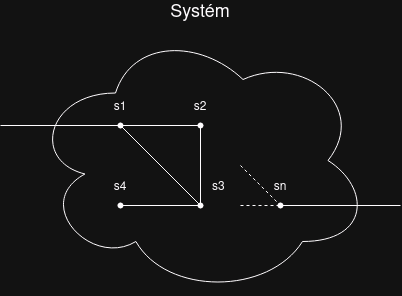

# Základní pojmy kybernetiky

## Systém
V kybernetice se systém chápe jako soubor prvků, které jsou mezi sebou určitým způsobem spojeny a tvoří celek. Tyto prvky mohou být spojeny látkovými, energetickými nebo informačními vazbami. Systém je možné odlišit od jeho okolí a definovat vztahy mezi systémem a jeho okolím.

*příklad: Jízdní kolo  – skládá se ze součástek (jednotlivé prvky) součástky jsou spojeny určitými vazbami určenými konstrukcí kola (strukturou) jízdní kolo tvoří celek, který dokážeme odlišit od okolí na kolo působí určité definovatelné vlivy (energie, ovládání apod.) jízdní kolo jako soustava umožňuje určitý proces (jízdu).*

## Vazba (vstupy, výstupy, zpětná vazba)

## Řízení

## 